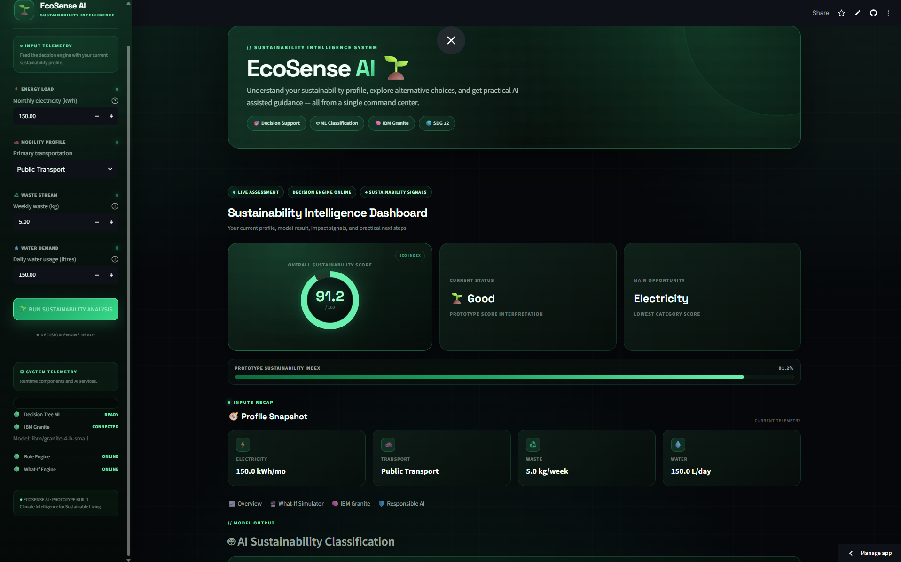
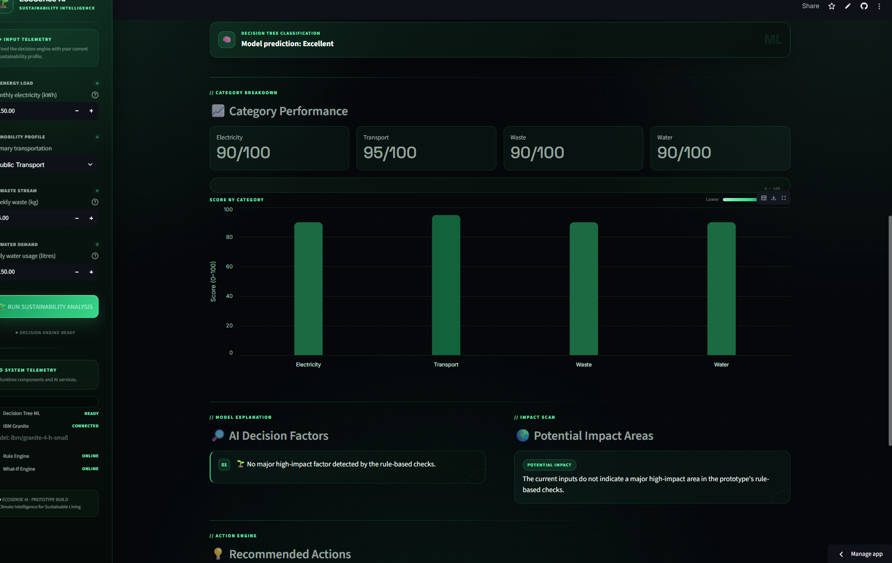
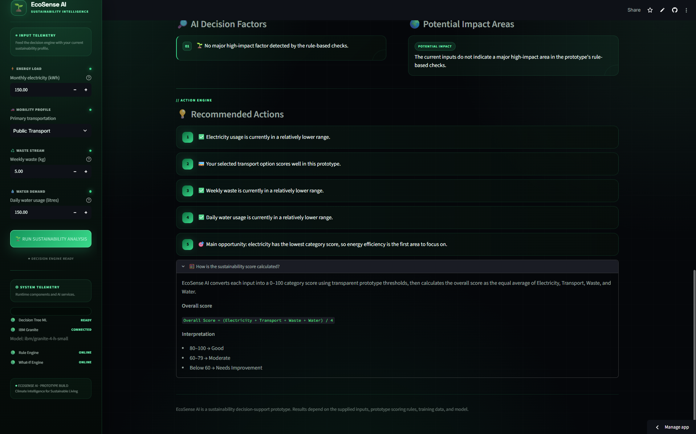
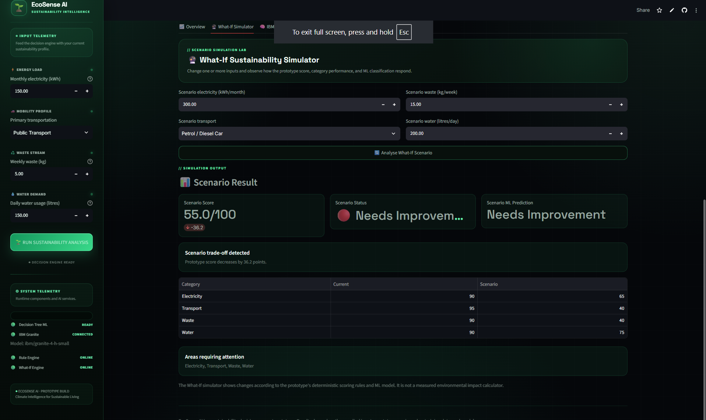
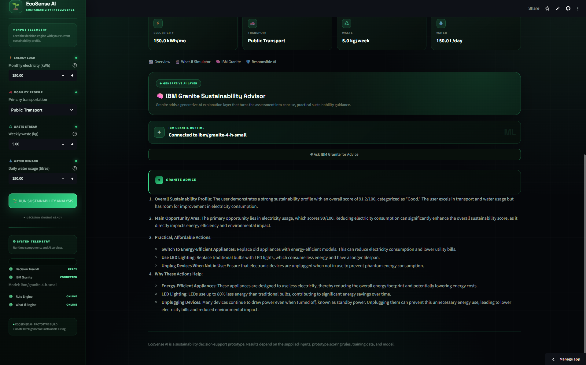
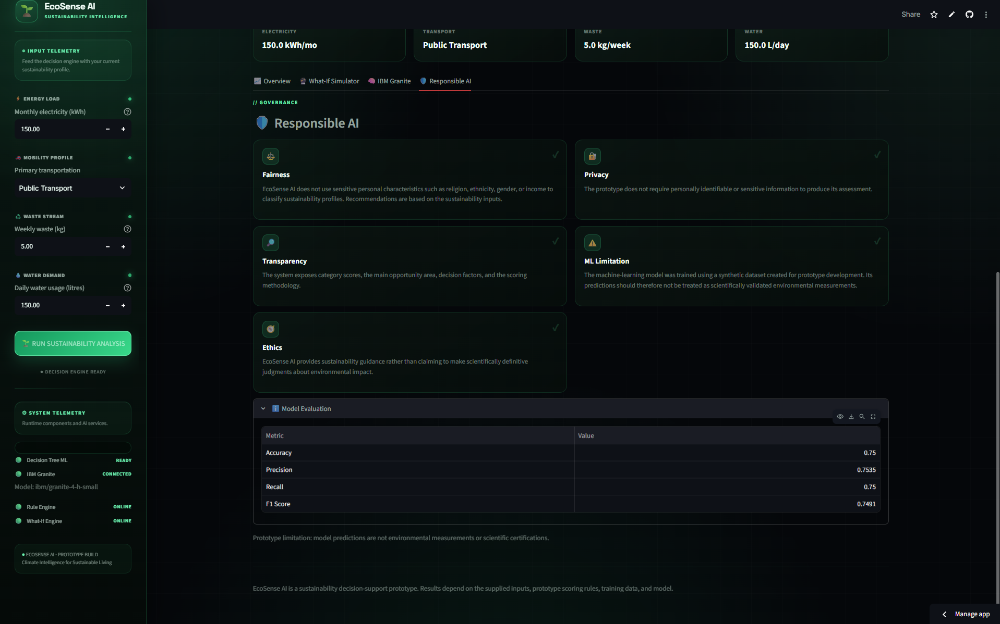

# 🌱 EcoSense AI

### AI-Powered Sustainability Decision Support

EcoSense AI is an interactive sustainability decision-support
application that combines transparent sustainability scoring, machine
learning, scenario simulation, and IBM Granite to help users understand
and improve everyday sustainability choices.

🌐 **Live Demo:**
https://ecosense-ai-lt5xtw3wpyetd6gcev3imz.streamlit.app/

------------------------------------------------------------------------

## ✨ What is EcoSense AI?

EcoSense AI analyzes four everyday sustainability factors:

-   ⚡ Electricity consumption
-   🚗 Transportation choice
-   ♻️ Waste generation
-   💧 Water consumption

The application combines a transparent rule-based scoring system with a
machine learning model and a generative AI advisor.

It provides:

-   🌱 An overall sustainability score
-   🧠 Machine learning classification
-   📊 Category-level sustainability analysis
-   🔮 What-If scenario simulation
-   🤖 IBM Granite recommendations
-   🛡️ Responsible AI information

------------------------------------------------------------------------

## 🚀 Key Features

### 🌱 Sustainability Assessment

Users enter information about their electricity use, transportation,
waste generation, and water consumption.

EcoSense converts each input into a category score from **0 to 100** and
calculates an overall sustainability score.

The dashboard also identifies the category with the lowest score as the
user's **biggest impact area**.

### 🧠 Machine Learning Classification

A Decision Tree Classifier independently predicts the sustainability
category based on the four input features.

Possible classifications are:

-   Excellent
-   Good
-   Moderate
-   Needs Improvement

### 🔮 What-If Simulator

The What-If simulator allows users to change their inputs and
immediately see how a different lifestyle scenario could affect their
sustainability profile.

It compares:

-   Current score
-   Scenario score
-   Score change
-   Category-level changes
-   Improved areas
-   Declined areas
-   Scenario ML classification

### 🤖 IBM Granite Sustainability Advisor

IBM Granite provides AI-generated sustainability guidance based only on
the supplied sustainability profile and calculated results.

The advisor can:

-   Explain the user's sustainability profile
-   Identify the main improvement opportunity
-   Suggest practical actions
-   Explain why those actions may help
-   Provide simple and affordable suggestions

The application is designed to avoid inventing carbon-emission
quantities or making unsupported scientific, medical, financial, or
legal claims.

------------------------------------------------------------------------

## 📊 Sustainability Scoring

EcoSense AI calculates a score from **0 to 100** for each sustainability
category.

The four category scores are:

-   ⚡ Electricity
-   🚗 Transport
-   ♻️ Waste
-   💧 Water

The overall sustainability score is calculated as:

``` text
Overall Score =
(Electricity Score + Transport Score + Waste Score + Water Score) / 4
```

### 📈 Score Classification

  Score      Classification
  ---------- -------------------
  80--100    Good
  60--79     Moderate
  Below 60   Needs Improvement

### ⚡ Electricity Score

    Monthly Consumption   Score
  --------------------- -------
                  ≤ 100     100
               101--150      90
               151--200      80
               201--300      65
               301--400      45
                 \> 400      25

### 🚗 Transport Score

  Transport                Score
  ---------------------- -------
  Walking / Cycling          100
  Public Transport            95
  Electric Vehicle            85
  Motorcycle / Scooter        65
  Petrol / Diesel Car         40

### ♻️ Waste Score

    Weekly Waste   Score
  -------------- -------
             ≤ 2     100
            2--5      90
            5--7      75
           7--10      60
          10--15      40
           \> 15      20

### 💧 Water Score

    Daily Consumption   Score
  ------------------- -------
                ≤ 100     100
             101--150      90
             151--200      75
             201--250      60
             251--300      40
               \> 300      20

The application identifies the **biggest impact area** by finding the
category with the lowest score.

This helps users focus on the area where improvement may have the
greatest effect on their EcoSense profile.

------------------------------------------------------------------------

## 🧠 Machine Learning Model

EcoSense AI uses a **Decision Tree Classifier** for sustainability
category prediction.

### Input Features

``` text
electricity
transport
waste
water
```

### Target

``` text
category
```

### Dataset

The training dataset contains:

``` text
1,000 records
4 input features
4 target classes
```

The data is divided into:

``` text
80% Training
20% Testing
```

The split uses stratification and `random_state=42`.

### Model Configuration

``` python
DecisionTreeClassifier(
    max_depth=5,
    min_samples_split=10,
    min_samples_leaf=5,
    random_state=42
)
```

------------------------------------------------------------------------

## 📊 Model Evaluation

The current model achieved the following results on the held-out test
set:

  Metric                  Score
  -------------------- --------
  Accuracy               75.00%
  Weighted Precision     75.35%
  Weighted Recall        75.00%
  Weighted F1 Score      74.91%

### Feature Importance

  Feature         Importance
  ------------- ------------
  Electricity         33.01%
  Waste               31.35%
  Transport           26.08%
  Water                9.55%

The trained model is stored at:

``` text
src/sustainability_model.joblib
```

The model evaluation results are stored at:

``` text
src/model_evaluation.joblib
```

The training workflow is contained in:

``` text
src/train_model.py
```

------------------------------------------------------------------------

## 🔮 What-If Scenario Simulator

The What-If simulator is designed to answer questions such as:

> "What happens to my sustainability profile if I reduce electricity
> consumption and switch to public transport?"

Users can create an alternative scenario by changing:

-   Electricity consumption
-   Transportation method
-   Waste generation
-   Water consumption

EcoSense then calculates the scenario using the same scoring methodology
and also runs the ML classifier on the scenario inputs.

### Example

A user can compare:

``` text
Current Profile
Electricity: 500
Transport: Petrol/Diesel Car
Waste: 20
Water: 350
```

with:

``` text
Improved Scenario
Electricity: 150
Transport: Public Transport
Waste: 5
Water: 150
```

The simulator makes the change visible through score differences and
category-level comparisons.

------------------------------------------------------------------------

## 🤖 IBM Granite Integration

EcoSense AI integrates IBM Granite through the IBM watsonx API.

The application uses IBM authentication to obtain an IAM access token
and then sends the sustainability profile to the configured Granite
model.

The default model configuration is:

``` env
GRANITE_MODEL_ID=ibm/granite-4-h-small
```

### Environment Variables

Local development uses a `.env` file in the project root:

``` env
WATSONX_API_KEY=your_api_key
WATSONX_PROJECT_ID=your_project_id
WATSONX_URL=https://us-south.ml.cloud.ibm.com
GRANITE_MODEL_ID=ibm/granite-4-h-small
```

**Never commit API keys or other secrets to GitHub.**

The `.env` file is excluded through `.gitignore`.

For the deployed application, credentials are configured through
Streamlit Community Cloud secrets rather than being stored in the
repository.

### AI Safety Approach

The Granite prompt instructs the model to:

-   Use only the supplied information
-   Avoid inventing quantitative environmental claims
-   Avoid unsupported scientific certainty
-   Avoid medical, financial, or legal claims
-   Avoid requesting or exposing sensitive personal information
-   Mention prototype limitations when appropriate

------------------------------------------------------------------------

## 🛡️ Responsible AI

EcoSense AI is a prototype decision-support application.

Its results should not be treated as a definitive scientific measurement
of an individual's complete environmental impact.

Important limitations include:

-   The sustainability score is based on predefined prototype
    thresholds.
-   The scoring system does not represent a complete carbon footprint.
-   The ML model depends on the quality and representation of its
    training dataset.
-   ML predictions should not be interpreted as absolute environmental
    classifications.
-   AI-generated recommendations can require human judgment.
-   External AI services may be unavailable or subject to usage limits.
-   The application does not claim scientific certainty about individual
    environmental outcomes.

The project intentionally keeps the deterministic scoring engine
separate from the generative AI component so users can understand the
basis of their score.

------------------------------------------------------------------------

## 🏗️ System Architecture

``` text
                         ┌─────────────────────┐
                         │      User Input     │
                         │                     │
                         │ Electricity         │
                         │ Transport           │
                         │ Waste               │
                         │ Water               │
                         └──────────┬──────────┘
                                    │
                     ┌──────────────┴──────────────┐
                     │                             │
                     ▼                             ▼
          ┌─────────────────────┐       ┌─────────────────────┐
          │ Sustainability      │       │ Decision Tree       │
          │ Scoring Engine      │       │ ML Classifier       │
          └──────────┬──────────┘       └──────────┬──────────┘
                     │                             │
                     └──────────────┬──────────────┘
                                    │
                                    ▼
                         ┌─────────────────────┐
                         │   EcoSense Dashboard│
                         │                     │
                         │ Overall Score       │
                         │ Classification      │
                         │ Impact Areas        │
                         │ Recommendations     │
                         └──────────┬──────────┘
                                    │
              ┌─────────────────────┼─────────────────────┐
              │                     │                     │
              ▼                     ▼                     ▼
       ┌──────────────┐      ┌──────────────┐      ┌──────────────┐
       │ What-If      │      │ IBM Granite  │      │ Responsible  │
       │ Simulator    │      │ Advisor      │      │ AI           │
       └──────────────┘      └──────────────┘      └──────────────┘
```

------------------------------------------------------------------------

## 🛠️ Technology Stack

  Area                        Technology
  --------------------------- ---------------------------
  Application                 Streamlit
  Programming Language        Python
  Data Processing             Pandas
  Machine Learning            Scikit-learn
  ML Model                    Decision Tree Classifier
  Model Serialization         Joblib
  Visualization               Altair
  Generative AI               IBM Granite
  AI Platform                 IBM watsonx
  API Communication           Requests
  Environment Configuration   python-dotenv
  Version Control             Git / GitHub
  Deployment                  Streamlit Community Cloud

------------------------------------------------------------------------

## 📁 Project Structure

``` text
EcoSense-AI/
│
├── app/
│   └── app.py
│
├── data/
│   └── sustainability_training_data.csv
│
├── docs/
│
├── images/
│
├── notebooks/
│
├── src/
│   ├── train_model.py
│   ├── sustainability_model.joblib
│   └── model_evaluation.joblib
│
├── .gitignore
├── README.md
└── requirements.txt
```

### Secret Files

The local `.env` file is intentionally excluded from version control.

The following types of files should never be committed:

``` text
.env
.streamlit/secrets.toml
```

API keys and other credentials must remain private.

------------------------------------------------------------------------

## ⚙️ Installation

### 1. Clone the Repository

``` bash
git clone https://github.com/anantttttt/EcoSense-AI.git
cd EcoSense-AI
```

### 2. Create a Virtual Environment

#### Windows

``` powershell
python -m venv .venv
.\.venv\Scripts\Activate.ps1
```

#### macOS / Linux

``` bash
python -m venv .venv
source .venv/bin/activate
```

### 3. Install Dependencies

``` bash
pip install -r requirements.txt
```

### 4. Configure IBM Granite

Create a `.env` file in the project root:

``` env
WATSONX_API_KEY=your_api_key
WATSONX_PROJECT_ID=your_project_id
WATSONX_URL=https://us-south.ml.cloud.ibm.com
GRANITE_MODEL_ID=ibm/granite-4-h-small
```

If IBM Granite credentials are not configured, the core sustainability
analysis can still run and the application can use its fallback behavior
where applicable.

### 5. Run EcoSense AI

``` bash
streamlit run app/app.py
```

The application will open in your browser.

------------------------------------------------------------------------

## 🧪 Testing

EcoSense AI was tested across application functionality, error handling,
environment setup, and deployment behavior.

### Functional Tests

-   Normal sustainability profiles
-   Boundary input values
-   Extreme input values
-   Different transportation choices
-   ML classification
-   What-If improvement scenarios
-   What-If deterioration scenarios
-   What-If no-change scenarios

### Reliability Tests

-   Missing `.env`
-   Missing IBM credentials
-   Invalid IBM credentials
-   IBM API usage-limit responses
-   Granite unavailable/fallback behavior
-   Streamlit reruns
-   Session-state persistence
-   Application startup and crash checks

### Environment Tests

The application was also tested in a clean Python virtual environment
using the dependencies listed in `requirements.txt`.

------------------------------------------------------------------------

## ☁️ Deployment

EcoSense AI is deployed using **Streamlit Community Cloud**.

### Live Application

🌐 https://ecosense-ai-lt5xtw3wpyetd6gcev3imz.streamlit.app/

### Deployment Configuration

``` text
Repository: anantttttt/EcoSense-AI
Branch: main
Entry Point: app/app.py
```

Secrets required by the deployed application are configured through the
deployment platform and are not stored in GitHub.

------------------------------------------------------------------------

## 🎯 Project Objectives

The project explores how multiple AI and software techniques can work
together to create a practical sustainability decision-support system.

The main objectives are:

1.  Provide transparent sustainability scoring.
2.  Apply machine learning to sustainability classification.
3.  Allow users to explore alternative scenarios.
4.  Use generative AI for personalized guidance.
5.  Keep AI behavior grounded in supplied information.
6.  Present results through an accessible interactive dashboard.
7.  Demonstrate responsible AI principles in a practical application.

------------------------------------------------------------------------

## 🔮 Future Improvements

Potential future development includes:

-   Larger and more representative sustainability datasets
-   Improved model calibration
-   Additional environmental dimensions
-   Historical sustainability tracking
-   Personalized sustainability goals
-   User accounts
-   Advanced scenario optimization
-   Validated carbon-footprint estimation
-   More comprehensive environmental impact metrics
-   Expanded IBM Granite capabilities
-   Automated model monitoring
-   CI/CD integration
-   Expanded automated testing

------------------------------------------------------------------------

## 📌 Project Status

``` text
✅ Sustainability scoring
✅ Machine learning classification
✅ Model evaluation
✅ What-If simulator
✅ IBM Granite integration
✅ Responsible AI guidance
✅ Interactive dashboard
✅ Error handling
✅ Testing
✅ GitHub repository
✅ Streamlit deployment
```

------------------------------------------------------------------------

## 👨‍💻 Project Goal

EcoSense AI demonstrates how a transparent rule-based system, machine
learning, generative AI, and interactive simulation can be combined into
one sustainability-focused application.

The core design is:

``` text
Transparent Scoring
        +
Machine Learning
        +
What-If Simulation
        +
Generative AI
        +
Responsible AI
        =
EcoSense AI
```

------------------------------------------------------------------------

---

## 📸 Application Screenshots

### 🏠 Main Dashboard



### 📊 Category Performance



### 💡 Recommended Actions



### 🔮 What-If Simulator



### 🤖 IBM Granite Sustainability Advisor



### 🛡️ Responsible AI




-----------------------------------------------------------------------

## 📄 License

This project is intended to be released under the **MIT License**.

See the `LICENSE` file for the complete license text.

------------------------------------------------------------------------

## ⭐ Acknowledgements

Built with:

-   Python
-   Streamlit
-   Pandas
-   Scikit-learn
-   Altair
-   IBM watsonx
-   IBM Granite
